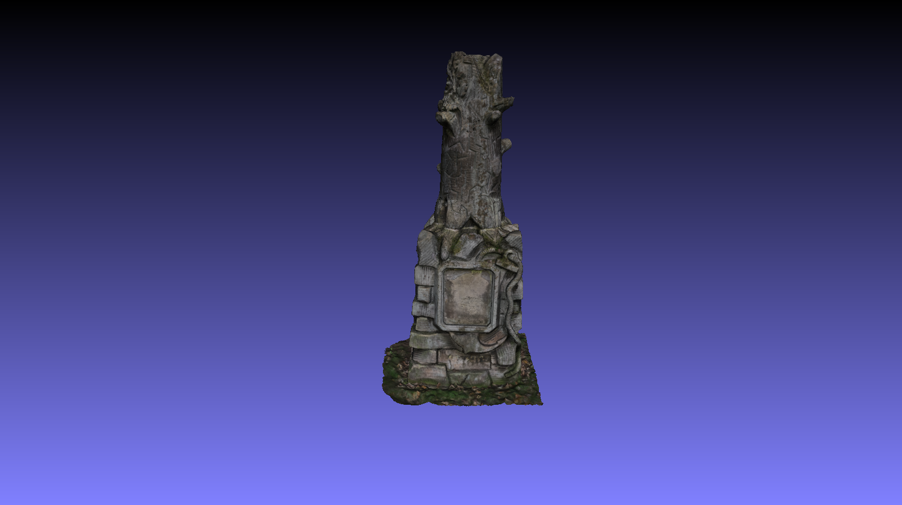

# 3D Photogrammetry - Kirkel memorial
Here just an example of the photogrammetry done by me from scratch (Photogrammetry = reconstruction process of building 3D model from many 2D images where 3rd dimension (depth) is lost). 
  
Couple of years ago I took ~130 pictures of one memorial I found in [Kirkel, Saarland](https://en.wikipedia.org/wiki/Kirkel). Exact location where this memorial stands is [here](https://www.google.com/maps/place/49%C2%B017'11.4%22N+7%C2%B013'57.8%22E/@49.286502,7.2321778,184m/data=!3m2!1e3!4b1!4m6!3m5!1s0x0:0x1b692cdb3b45ac37!7e2!8m2!3d49.2865021!4d7.2327248) in **"Alter Friedhof"**.
  
<ins>Memorial picture:</ins> 

<ins>Tools used to create 3D model</ins>:
- iPhone SE (1st generation)
- **[Meshroom](https://alicevision.org/#meshroom "Meshroom")** to create 3D model with textures (opensource)
- **[MeshLab](https://www.meshlab.net/ "MeshLab")** to clean the model a little bit (opensource)

<ins>Input</ins>:
- source pictures (you can use them to do it with different settings)

<ins>Output</ins>:
- final 3D model for [downloading](https://1drv.ms/f/s!AqubZJHsswotmEcXTndyIeHlgMlM?e=BxWMZc) (you can use it for **free for any purpose, but please always mention me as the source**)

<ins>HW used to generate model</ins>:
- **Dell Precision Tower 7810** (10 cores Intel Xeon E5-2630 V4 2.20 GHz + 64 GB RAM + nVIDIA Quadro M4000 8GB)
---
Note: The result depends mostly on how good the pictures are (**means also they have to overlap each other by 70-80%**) and sunlight conditions (**recommended when cloudy to avoid unnecessary shadows**, etc.), but anyone can do it simply at home with pretty much any kind of professional camera system.
